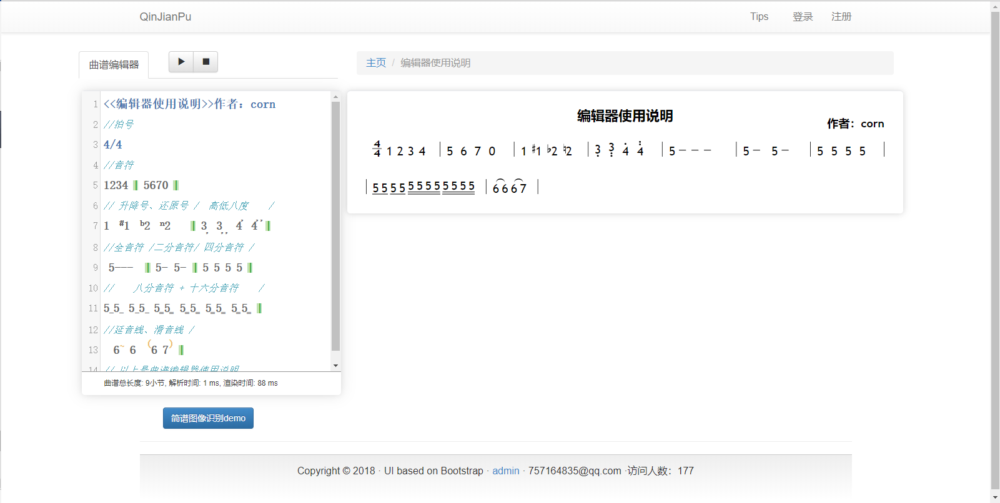
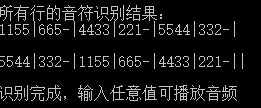

# QinJianPu

​	轻简谱总体思路就是 简谱编辑器+论坛。想实现一个既可以创建简谱，又能分享的曲谱社区。

轻简谱具有以下功能：

1. 简谱制谱，可实现在页中的完成简谱的制作和修改
2. 简谱播放，可播放曲谱上的内容。
3. 图像识别，用户上传简谱谱例便可生成可供播放的格式以及可供修改的格式。
4. 论坛功能，提供用户论坛的谱例上传、曲谱修改、曲谱评论，曲谱管理。
5. 后台管理，系统管理员可在后台实现启用、禁用用户登录、曲谱管理、评论管理以及分类管理。


 ## 使用技术

OpenCV 3.3.0 + Tess4J 4.0 简谱识别
基于CodeMirror.js代码编辑器框架
简谱论坛、后台管理 ：基于J2EE
snap.svg矢量图操作框架的简谱制谱工具


## 系统界面


 #### 首页，可以查看论坛当中分享的曲谱


 #### 曲谱编辑页面，可创建曲谱，带有图像识别、曲谱编辑、曲谱播放等功能




 #### 查看曲谱功能，一般用于游客


 #### 曲谱识别的界面


 #### 后台管理界面1


 #### 后台管理界面2


 ## 图像识别原理及部分代码





```java
public static List<Mat> horizontalProjection(Mat inputMat) {
		int height = inputMat.height();// 图片的高度
		int width = inputMat.width();// 长度
		double[] pixelValue = null;// 获取的每个像素值
		int[] projectValArry = new int[height];// 存储每行的像素量
		// 如果该行有255像素的像素点，则记录下来ֵ
		for (int row = 0; row < height; row++) {
			for (int col = 0; col < width; col++) {
				pixelValue = inputMat.get(row, col);
				if (pixelValue[0] != 0)// 没有则跳过
					projectValArry[row]++;}}
		// 按照上面的得出的行信息绘制出每行的框框
		pixelValue[0] = 255; // 像素点为255
		Mat dst = new Mat(height, width, CvType.CV_8UC1);
		for (int row = 0; row < height; row++) {
			for (int col = 0; col < projectValArry[row]; col++) {
				dst.put(row, col, pixelValue[0]);}}
		// 按行切割
		List<Mat> rowsImgsList = new ArrayList();
		Mat rowsImg = null;
		int rowsNum = 0;
		Scalar color = new Scalar(255, 0, 0);
		// 获取每行的top,bottom
		for (int row = 0; row < height; row++) {
			pixelValue = dst.get(row, 0);
			if (pixelValue[0] != 0) {
				int top = row;
				// System.out.println("top:" + row);
				for (row = top; row < height; row++) {
					pixelValue = dst.get(row, 0);
					if (pixelValue[0] == 0) {
						// 获得底部
						int bottom = row;
						Imgproc.rectangle(dst, new Point(0, top), new Point(width, bottom), color);
						Rect rect = new Rect(0, top, width, bottom - top);// 得出rect
						rowsImg = new Mat(inputMat, rect);// 单行
						rowsImgsList.add(rowsNum, rowsImg);// 存入集合中
						rowsNum++;
						break;}
                }
            }
        }
		return rowsImgsList;
}

```


因为对自己的识别率不是很满意所以用了jTess来手动提高识别率。😂


## 参考链接

[CodeMirror.js代码编辑器框架文档](http://codemirror.net/)

[Snap.js  对于Svg矢量图进行对象操作的js框架](http://snapsvg.io/)

[MIDI.js  乐器播放开源js框架](https://github.com/mudcube/MIDI.js)

[OpenCV Java documentation (3.4.1)  图像识别Java文档](https://docs.opencv.org/3.4.1/javadoc/index.html)

[Tess4J 基于Java的文字识别开源库文档](http://tess4j.sourceforge.net/docs/docs-4.0/)

[百度OCR文字识别API文档](http://ai.baidu.com/docs#/OCR-API/top)


感谢支持😘
